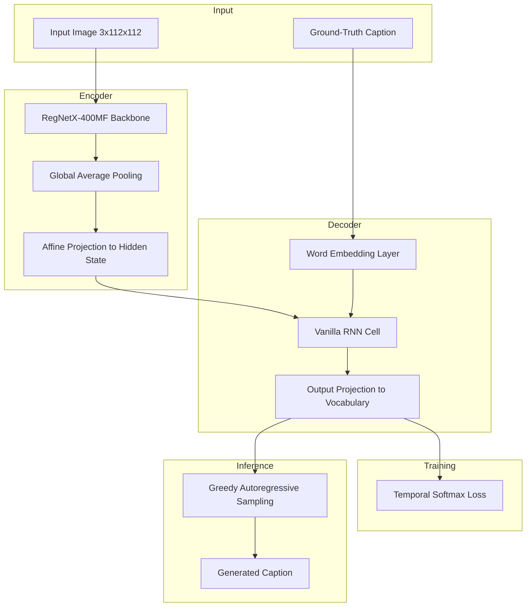

<div align="center">
  
</div>

---

# Image Captioning with Vanilla Recurrent Neural Network on MS-COCO

A from-scratch PyTorch implementation of an image captioning pipeline that couples a convolutional image encoder with a hand-derived vanilla RNN language decoder, trained end-to-end on the MS-COCO Captions dataset to generate natural-language descriptions of images.

<div align="left">

[](https://www.python.org/)
[](https://pytorch.org/)
[](https://pytorch.org/vision/stable/index.html)
[](https://numpy.org/)
[](https://jupyter.org/)
[](http://cocodataset.org/)
[](#)
[](#)
[](https://opensource.org/licenses/MIT)

</div>

## Abstract

Generating a coherent natural-language description of an image requires bridging two very different modalities: spatial visual features and sequential linguistic structure. This project implements that bridge from first principles: a pretrained RegNetX-400MF backbone extracts spatial image features, which are projected into the initial hidden state of a vanilla Recurrent Neural Network. The RNN is unrolled over word embeddings of the ground-truth caption, and a temporal softmax loss trains the network to predict the next word at every timestep. Both the forward and backward passes of the RNN cell, the word embedding layer, the temporal loss, and the greedy sampling procedure used at inference time are implemented manually rather than relying on a black-box `nn.RNN` module, giving full visibility into how a recurrent language model learns to describe visual content.

## Table of Contents

1. [Overview](#overview)
2. [Key Features](#key-features)
3. [Model Architecture](#model-architecture)
4. [Implementation Details](#implementation-details)
   - [Vanilla RNN Cell](#vanilla-rnn-cell)
   - [Word Embeddings and Temporal Loss](#word-embeddings-and-temporal-loss)
5. [Dataset](#dataset)
6. [Project Structure](#project-structure)
7. [Installation](#installation)
8. [Results](#results)
9. [License](#license)
10. [Author](#author)
11. [Support](#support)

## Overview

This repository implements an encoder-decoder image captioning system built around a **vanilla RNN** decoder, following the classical formulation popularized by early neural captioning work such as *Show and Tell*. Rather than treating the RNN as an opaque library layer, every core component is derived and coded manually:

* A convolutional image encoder (RegNetX-400MF) extracts spatial grid features from input images.
* A single-layer vanilla RNN, with its forward and backward recurrence implemented by hand, consumes word embeddings and produces hidden states over time.
* A temporal softmax loss trains the network to predict each next word in the caption while correctly ignoring padding tokens.
* A greedy, autoregressive sampling procedure generates captions for unseen images at test time.

The model is trained and evaluated on a preprocessed subset of the **MS-COCO Captions** dataset, first validated by overfitting a small sample to confirm correctness, then trained on a larger split to produce descriptive captions for held-out validation images.

## Key Features

* Hand-derived forward and backward passes for the vanilla RNN recurrence (no reliance on `torch.nn.RNN`)
* Custom word embedding layer mapping caption tokens to dense vectors
* Temporal softmax cross-entropy loss with `<NULL>` token masking for variable-length captions
* CNN-to-RNN feature bridging via a learned affine projection from image features to the initial hidden state
* Pretrained RegNetX-400MF backbone for efficient spatial feature extraction
* Greedy autoregressive caption sampling at inference time, starting from a `<START>` token
* End-to-end trainable `CaptioningRNN` module combining vision and language components
* Correctness validated via a small-batch overfitting experiment before full-scale training

## Model Architecture

The system follows an encoder-decoder architecture in which a convolutional network encodes the image into a fixed-size feature vector, which is then used to initialize a recurrent language decoder that generates the caption one word at a time.



### Architectural Components

| Component | Responsibility |
|:---|:---|
| Image Encoder | Extracts spatial visual features from RegNetX-400MF, pretrained on ImageNet |
| Feature Projection | Maps pooled image features to the RNN's initial hidden state |
| Word Embedding | Converts caption token indices into dense learned vectors |
| Vanilla RNN | Recurrently processes the caption sequence, updating its hidden state at each timestep |
| Output Projection | Maps RNN hidden states to scores over the full vocabulary |
| Temporal Softmax Loss | Computes cross-entropy loss per timestep while masking padding tokens |

## Implementation Details

### Vanilla RNN Cell

The single-timestep recurrence, its unrolled forward pass over a full sequence, and the corresponding backward pass for gradient computation are implemented manually:

* `rnn_step_forward` / `rnn_step_backward` — single-timestep tanh-activated recurrence and its gradient
* `rnn_forward` / `rnn_backward` — unrolling the recurrence (and its gradient) across an entire sequence
* `RNN` — a `nn.Module` wrapper exposing the recurrence as a trainable PyTorch layer

### Word Embeddings and Temporal Loss

* `WordEmbedding` — a lightweight embedding layer mapping vocabulary indices to dense vectors
* `temporal_softmax_loss` — cross-entropy loss applied independently at every timestep, summed over time and averaged over the batch, with an `ignore_index` mask for `<NULL>` padding tokens
* `CaptioningRNN` — the full model tying the encoder, embedding layer, RNN, and output projection together, exposing both a training-time `forward` (loss computation) and a test-time `sample` (caption generation) interface

## Dataset

The model is trained on a preprocessed subset of the **2014 MS-COCO Captions** dataset, the standard benchmark for image captioning research. Each image is annotated with multiple human-written captions collected via Amazon Mechanical Turk.

* Images resized to 112x112 for computational efficiency
* Captions tokenized, numericalized, and clamped to a maximum length of 15 words
* 10,000 training image-caption pairs and 500 validation pairs
* Serialized as a single `coco.pt` tensor bundle (~378 MB) containing images, tokenized captions, and the vocabulary mappings

Download the preprocessed dataset file:

```
http://web.eecs.umich.edu/~justincj/teaching/eecs498/coco.pt
```

Place the downloaded `coco.pt` file under a local `datasets/` directory before running the notebook.

## Project Structure

```
Image-Captioning-with-Vanilla-RNNs-on-MS-COCO
│
├── rnn_captioning.ipynb
├── rnn_captioning.py
├── a5_helper.py
│
├── helpers_module/
│   ├── __init__.py
│   ├── data.py
│   ├── grad.py
│   ├── solver.py
│   └── utils.py
│
└── README.md
```

## Installation

### Clone Repository

```bash
git clone https://github.com/ParmidaGh/Image-Captioning-with-Vanilla-RNNs-on-MS-COCO.git

cd Image-Captioning-with-Vanilla-RNNs-on-MS-COCO
```

### Create Environment

```bash
conda create -n rnn-captioning python=3.10

conda activate rnn-captioning
```

### Install Dependencies

```bash
pip install torch torchvision numpy matplotlib seaborn
```

### Run the Notebook

```bash
jupyter notebook rnn_captioning.ipynb
```

## Results

Correctness of the training loop and model implementation is first validated by overfitting on a small subset of 50 image-caption pairs, where the loss should collapse near zero if the RNN, embedding layer, and loss function are implemented correctly:

| Epoch | Loss |
|:---|:---|
| 0 | 75.06 |
| 20 | 22.96 |
| 40 | 9.71 |
| 60 | 3.14 |
| 79 | 0.25 |

The final overfitting loss of **0.25** confirms that the vanilla RNN decoder, word embeddings, and temporal loss are correctly implemented and able to fit training data. The same architecture is then trained on the full 10,000-example split to produce captions on held-out validation images via greedy sampling.

## License

This project is licensed under the MIT License.

---

## Author

**Parmida Ghamari**
M.Sc. Student, University of Tehran
Research Assistant @ Social Networks Lab

**Research Interests:** Deep Learning, Recurrent Neural Networks, Sequence Modeling, Computer Vision, Vision-Language Models, Neural Image Captioning

📧 [Parmida.ghamari@gmail.com](mailto:Parmida.ghamari@gmail.com) | 💻 [github.com/ParmidaGh](https://github.com/ParmidaGh) | 💼 [linkedin.com/in/parmida-ghamari](https://www.linkedin.com/in/parmida-ghamari)

---

## Support

If you find this project useful, consider giving it a star.

---

<p align="center">
  Built with PyTorch and Torchvision
</p>
